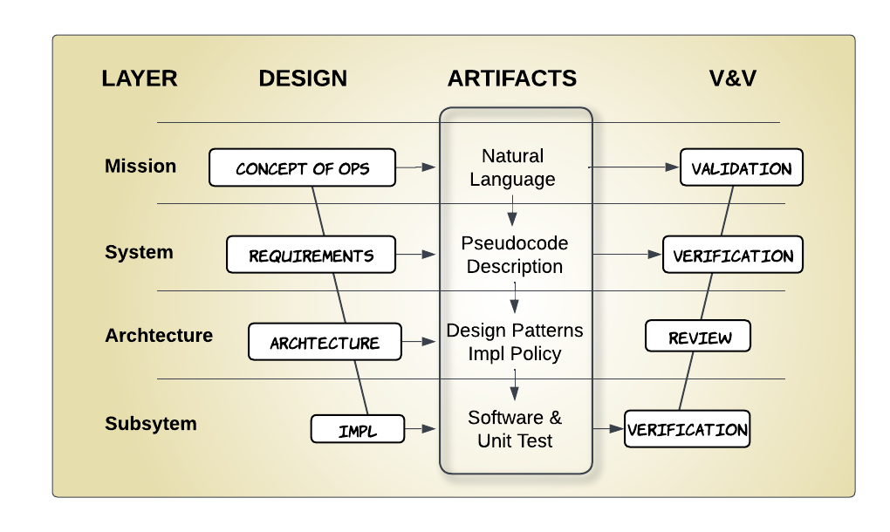

# End-to-End AI-Assisted Software Development Workflow


<div style="text-align: center;">
<p>Author: Spencer Barrett</p>
<p>Inspired: By the power of NLP & GPT after taking Laurence Moroney - Intro to Generative AI for SW Dev</p>
<p>Date: December 15, 2024</p>
</div>

# Abstract
Current AI-assisted coding tools focus on isolated tasks within the software development lifecycle, such as code writing, testing, and review. This fragmented approach limits their effectiveness and fails to provide a cohesive solution that integrates all stages of development.

This paper introduces an end-to-end AI-assisted software development workflow that spans the entire lifecycle—from high-level requirements through detailed design, code generation, and automated unit testing. The workflow emphasizes well-documented artifacts at every stage while supporting user intervention when needed. By addressing the limitations of existing AI tools, this approach enables a holistic and efficient development process.

Central to this workflow is the adoption of Test-Driven Development (TDD). Unlike conventional AI systems marketed for rapid prototyping, this approach incorporates benchmark policies and unit tests to deliver production-quality code. High-level requirements are validated against unit tests, which in turn verify the target software. Generative AI accelerates both unit test creation and code implementation, ensuring consistency and reliability. Furthermore, the workflow’s capacity for reflection and self-refinement promises significant potential for iterative improvement in future software development. 

The diagram above leverages the Model-Based Systems Engineering (MBSE) V-Diagram and shows the necessary artifacts to support the full-cycle workflow proposed by this paper.

# Setup
### Download ai_sw_workflow.git
The template command creates a recipe template fibonacci/fibonacci_recipe.yaml 
```
mkdir aiproject
cd aiproject
git clone git@github.com:unbedded/ai_sw_workflow.git
cp ai_sw_workflow/Makefile ./
make template new_name=fibonacci
```
Your directory structure will now look like this. The template command will copy the template directory to your cwd and rename it as 'fibonacci`
```
├── Makefile
│── fibonacci
│   ├── __init__.py
│   └── fibonacci_recipe.yaml
│
├── ai_sw_workflow
│   ├── ai_sw_workflow.py
│   ├── argument_parser.py
│   ├── Makefile
│   ├── policy
│   │   ├── policy_c++20.yaml
│   │   ├── policy_gtest.yaml
│   │   ├── policy_pseudo.yaml
│   │   ├── policy_pytest.yaml
│   │   └── policy_python3.8.yaml
│   ├── README.md
│   ├── requirements.txt
│   └── template
│       ├── __init__.py
│       └── template_recipe.yaml

```

### OPENAI_API_KEY
Create an OpenAI API account and store the API key in an environment variable. 
```
export OPENAI_API_KEY="sk-proj-nImqa8o3Lp-7........PSVSygA"
```
### MODEL
Makefile has several models it will work with. The code quality of gpt-4o is far superior to 3.5-turbo
```
MODEL = 'gpt-4o'
# MODEL = 'gpt-4o-mini'
# MODEL = 'o1-mini'
# MODEL = "gpt-3.5-turbo"
```

### Create a Recipe
Paste the following into ./fibonacci/fibonacci_recipe.yaml
```
target_name: Fibonacci

requirements: |
  - Implement method get(index) 
  - Return Fibonacci number at the specified index.
  - Return zero if index is not a positive integer.  
  - Name variables based on pirate slang

architecture: |
  - Encapsulate functionality into a class named [TARGET_NAME].
  - Thread-safe is not required - single-threaded operation is sufficient.
  - Accept an optional maximum index (max_index) during initialization to limit the range of Fibonacci numbers.
  - Handle edge cases and invalid operations predictably.
  - Use caching to store previously calculated Fibonacci numbers for performance optimization.

# code_requirements: |
#   - <list implementation requirements here>

test_enable: True
test_requirements: |
  - Test edge cases and invalid operations
  - Include import logging
  
# code_references: |
#   - <list files to reference>  
```

## AutoGenerating Python Code

### Prerequisites
Edit Makefile to select language
```
# Conditional variable to switch between language policies
POLICY_MODE = python3.8
```

The project will work with Python 3.8 or greater. Your virtual environment must install the ./ai_sw_workflow/requirements.txt, which includes module dependencies:
```
openai
pytest
pyyaml
coverage
```
### Activate and Make
Run the Makefile to autogenerate code and build tests. The Makefile uses the following policies for autogeneration:
- CODE POLICY: `policy=ai_sw_workflow/policy/policy_python3.8.yaml`:
- TESTING POLICY: `policy=ai_sw_workflow/policy/policy_pytest.yaml`:
```
source .venv/bin/activate
make
```

## AutoGenerating C++ Code
### Prerequisites
Edit Makefile to select language
```
# Conditional variable to switch between language policies
POLICY_MODE = c++20
```
Verify your compiler supports C++20 (202002L → C++20)
```
preact@oryx:~/sw/example_ai_workflow$ g++ --version
g++ (Ubuntu 9.4.0-1ubuntu1~20.20.02L) 9.4.0
Copyright (C) 2019 Free Software Foundation, Inc.
This is free software; see the source for copying conditions.  There is NO
warranty; not even for MERCHANTABILITY or FITNESS FOR A PARTICULAR PURPOSE.

```
Install GoogleTest
```
sudo apt update
sudo apt install libgtest-dev
```

Run the Makefile to autogenerate code and build tests. The Makefile uses the following policies for autogeneration:
- CODE POLICY: `policy=ai_sw_workflow/policy/policy_c+20.yaml`:
- TESTING POLICY: `policy=ai_sw_workflow/policy/policy_gtest.yaml`:
```
source .venv/bin/activate
make
```

# Overview
AI solutions must address the *Complexity vs Efficacy* trade-off. The more complex a task, the more guessing AI performs unless you are leveraging a well-known pattern. Successful AI solutions for complex tasks must break down problems into hierarchical, simpler tasks handled by multiple agents. Decomposing problems into structured stages is a concept embraced by agentic orchestration tools like CrewAI and LangChain.

**Pseudocode Intermediate** - While the primary focus of this paper is on software development, the same workflow can be applied to a variety of other domains. The workflow leverages AI large language models (LLMs) to transform high-level task descriptions into a detailed pseudo-language intermediate description. Using AI to transform your problem into an LLM-friendly pseudo-language is a powerful tool. This intermediate step allows developers to manually review pipeline artifacts and exercise control over the process at an intermediate pseudo-language level while leveraging AI to perform the heavy lifting to bootstrap the pseudo-language detailed descriptions.

**Large Language Models Challenges** (LLMs) are pattern inference machines trained on vast datasets. While they can generate plausible solutions, their effectiveness is influenced by how clearly requirements are presented, the LLM model, and the complexity of the problem. These challenges emphasize the need for well-structured prompts, version control, and diligent review to maximize the benefits of AI-assisted coding. Common challenges include:

- **Non-Typical Library Usage**: Users might want to use a library in a unique way, which does not match the pattern the LLM was trained with. LLMs will require specific guidance to accommodate.
- **Version Mismatch**: LLMs may use the wrong version of a library or language, which can lead to compatibility issues or broken code.
- **Unique Applications**: LLMs are great at guessing, but if your solution is unique, it requires the developer to provide extensive details.
- **Version of LLM**: This will greatly affect output. Models have improved significantly in the past year. GPT-4o and GPT-3.5-turbo are used in this paper, and the last chapter compares their relative performance. The good news is both models satisfied the example requirements, but GPT-4o was far superior.

While this workflow is demonstrated in a Jupyter Notebook with each step implemented manually, the process can be automated by defining the rules in a Makefile. The software development workflow comprises eleven steps, as illustrated in the accompanying diagram. Each section of this paper provides a detailed explanation of a specific step:

1. **Pseudocode Template**  
2. **High-Level Requirements**  
3. **LLM API Interface**  
4. **High-Level to Low-Level Requirements Translation**  
5. **Low-Level Requirements** - For target applications involving the *LLM challenges* above, custom intervention will be required at step 5 to manually edit the *Low-Level Requirements*.
6. **Coding Policy**  
7. **Low-Level Requirements to Code Translation**  
8. **Code Listing**  
9. **Testing Policy**  
10. **Code to Unit Test Translation**  
11. **Unit Test Listing**  

```
┌─ #2 ────────┐       ┌─ #5 ────────┐       ┌─ #8 ────────┐       ┌─ #11 ──┐   
│ HiLevel Rqmt┌─►#4──►│ LoLevel Rqmt┌─►#7──►│     Code    ┌─►#10─►│UnitTest│   
└─────────────┘   ▲   └─────────────┘   ▲   └─────────────┘   ▲   └────────┘   
            ┌─ #1 └───────┐       ┌─ #6 └───────┐       ┌─ #9 └───────┐          
            │ PseudoC Tmpl│       │ Code Policy │       │ Test Policy │          
            └─────────────┘       └─────────────┘       └─────────────┘          
```

### Notebook Prerequisites
The code makes use of the OpenAI API and expects an environment variable named **OPENAI_API_KEY** that contains your OpenAI API key. The included Python code is compatible with Python 3.8 or greater and requires the following modules to be included in your virtual environment:
```
 - pip install openai
 - pip install pyyaml            
```

Current AI coding practices often rely on iterative prompting, where developers engage in repetitive back-and-forth interactions to craft the desired output. This approach can be inefficient, leading to frustration and an increased risk of overlooking critical details. An alternative solution involves the use of templates that encapsulate requirements, best practices, and goals within a single, monolithic prompt. The template goal is:

- **Higher Efficacy**: Reduces the friction in interactions, minimizing the need for iterative refinement and redundant instructions.
- **Leverage Familiar Paradigms**: By framing requirements in popular pseudocode formats, templates align closely with LLM training data, increasing the likelihood of accurate outputs.
- **Reusability**: Templates standardize interactions and can be reused across similar projects. This also promotes consistency across the pipeline.
- **Human Oversight**: Allows developers to create detailed requirements from high-level instructions and validate AI-generated results to ensure reliability and correctness.

LLMs can understand a large variety of pseudocode paradigms, but greater efficiency is gained by leveraging pseudocode paradigms easily understood by LLMs. Pseudocode features that work well with LLMs have:

- **Hierarchical Indentation**: Text format defines structure.
- **Popularity**: Paradigms that are sufficiently trained into the LLM.
- **Expressiveness**: Capable of handling complex logic.

The architecture, error handling, and implementation requirements allow fine-tuning of the code and provide workarounds for LLM hallucinations. The template minimizes *redundant or insufficient prompting*, reducing excessive iteration to achieve the desired output and leading to greater efficiency. The YAML template has placeholders for the following parameters used to compile the LLM prompt:

- **target_name**: Defines the file name for the code.
- **requirements**: Uses a *Step Action Table* and *Structured Function Documentation* that leverage paradigms easily understood by LLMs. The template is extended by adding additional functions and parameters as needed.
- **architecture**: Isolates the high-level structure out of the functional requirements section.
- **error_handling**: Allows fine-tuning of error handling—could include logging or debug print requirements.
- **impl_requirements**: Helpful for refining the implementation or workarounds for hallucinations.
